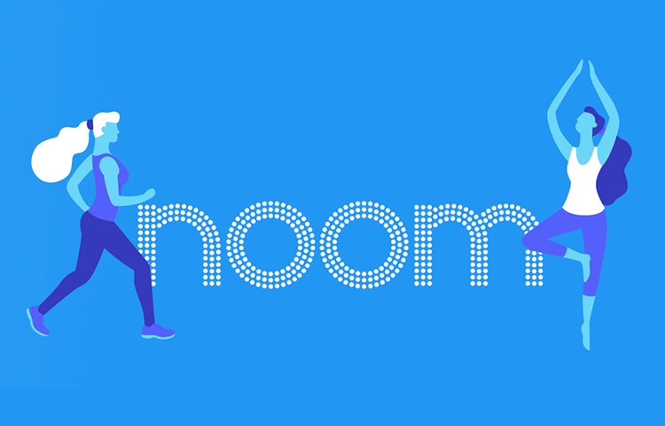
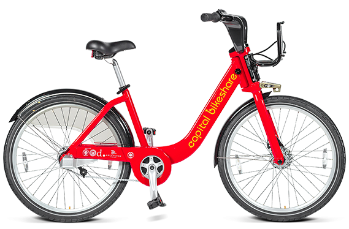

## Portfolio
<link rel="stylesheet" href="https://stackpath.bootstrapcdn.com/bootstrap/4.3.1/css/bootstrap.min.css" integrity="sha384-ggOyR0iXCbMQv3Xipma34MD+dH/1fQ784/j6cY/iJTQUOhcWr7x9JvoRxT2MZw1T" crossorigin="anonymous">
<section class="colorlib-skills" data-section="skills">
      

        

          

            TECH SKILLS
            <h2 class="colorlib-heading animate-box">저는 지금 이것을 할 수 있습니다.</h2>
          

        

        

          

            
개발의 처음 시작은 javascript로 시작하였습니다 이후에 패스트캠퍼스 웹프로그래밍 스쿨 과정을 들으며 Python을 바탕으로 <strong>컴퓨터 사이언스(메모리, 수, CPU, 가상메모리, 네트워크, 자료구조 등)</strong>를 공부하고 현재는 <strong>Django 프레임워크</strong>를 통해 서버 개발자로 활동하고 있습니다. 간단한 <strong>웹서비스를 혼자서 개발할 수 있으며, 서버에서는 REST API를 통해 Web Server 뿐만 아니라 APP(android, ios)의 서버</strong>를 구현 할 수 있습니다. 현재는 개인적으로 생각하던 서비스들을 하나씩 웹으로 출시하고 있습니다. 서비스의 완결성을 높여 출시하기 위해 html와 css, javascript 역시 공부하고 있습니다. 미래 기술에도 관심이 많아 지속적으로 딥러닝 공부를 이어가고 있습니다.

            
 진행한 프로젝트 배포는 <strong>헤로쿠, python anywhere 및 아마존 AWS</strong>를 통해 배포하였고, 사용자 증가를 대비하여 로드밸런서를 활용하여 EC2 서버를 확장하고, S3와 RDS를 늘려 DB를 확장시키는 것을 경험하였습니다. <strong>ec2를 활용한 직접 배포 및 elastic beanstalk를 통한 배포 그리고 docker</strong>에 대해서도 학습하였습니다. 또한 GitHub을 통해 소스 코드 및 프로젝트를 관리하고 협업하고 있습니다. 프로젝트 관리툴로는 <strong>slack, trello, wrike, confluence, google drive, github, notion</strong> 등을 경험하였습니다.
             
          

          

            

              <h3><strong>Python</strong></h3>
              

                 

                  60%
                  

              

              파이썬 기초에 대해서 공부하고, 파이썬을 통해 컴퓨터사이언스를 학습하였습니다. 파이썬 언어의 기본적인 문법에 대해 알고 있으며, 자료구조 및 알고리즘을 파이썬으로 공부하였습니다.
            

          

          

            

              <h3><strong>Django</strong></h3>
              

                 

                  60%
                  

              

              장고 프레임워크를 통해 서버 및 웹서비스를 개발하였습니다. 장고의 기능들에 배우며, REST API를 활용하여 프론트엔드와 함께 협업하여 서비스를 만들어 보았습니다.
            

          

          

            

              <h3><strong>Javascript</strong></h3>
              

                 

                  40%
                  

              

              javascript의 기본 문법을 익히고 jquery를 통해 직접 웹프론트에서 구동하도록 구현하고, ajax를 통해 서버와 통신하며 댓글 기능 등을 직접 구현하였습니다. 
            

          

          

            

              <h3><strong>HTML5</strong></h3>
              

                 

                  45%
                  

              

              웹서비스를 기획하며 직접 html 템플릿을 구성하고, 장고 템플릿 문법을 적절히 적용하여 원하는 데이터를 원하는 위치에 넣을 수 있도록 연습하였습니다.
            

          

          

            

              <h3><strong>CSS3</strong></h3>
              

                 

                  30%
                  

              

              부트스트랩의 한계에 대해 느끼며, 특정 부분들에 대해 CSS를 적용하여 프론트를 꾸몄습니다. 또한 모바일에서도 잘 작동할 수 있도록 기본적인 반응형에 대해 공부하였습니다.
            

          

          

            

              <h3><strong>AWS</strong></h3>
              

                 

                  40%
                  

              

              AWS를 서버로 활용하며, EC2를 확장하고 로드밸런서를 연결해주었습니다. 직접 배포 및 elastic beanstalk를 활용한 배포, 현재는 도커에 대해 학습하고 있습니다.
            

          

          

            

              <h3><strong>Github</strong></h3>
              

                 

                  40%
                  

              

              대부분의 프로젝트를 github를 통해 소스 코드를 관리하였으며, 협업 역시 github을 통해 진행하였습니다. 또한 github서버를 활용하여 블로그 및 포트폴리오 사이트를 관리합니다.
            

          

          

            

              <h3><strong>딥러닝</strong></h3>
              

                 

                  20%
                  

              

            

            미래 기술에 관해 관심을 항상 가지고 있으며, 차근차근 하나씩 공부해가고 있습니다. 기본적인 신경망에 관해 공부하고 손글씨 학습 등을 예제로 공부하였습니다.
          

        

      

    </section>
---

### Data Analysis 

[Project "Noom"](https://nbviewer.jupyter.org/github/kyugshim/kyugshim.github.io/blob/master/portfolio-%20noom.ipynb)

---

### Data Analysis/Machine Learning
[Project 2 "Titanic-Machine Learning from Disaster"](https://nbviewer.jupyter.org/github/kyugshim/kyugshim.github.io/blob/master/Portfolio2%20-%20Titanic-%20Machine%20Learning%20from%20Disaster.ipynb)

---

### Data Analysis/Machine Learning
[Project 3 "Bike Sharing Demand"](https://nbviewer.jupyter.org/github/kyugshim/kyugshim.github.io/blob/master/portfolio-bike-sharing-demand.ipynb)

---
